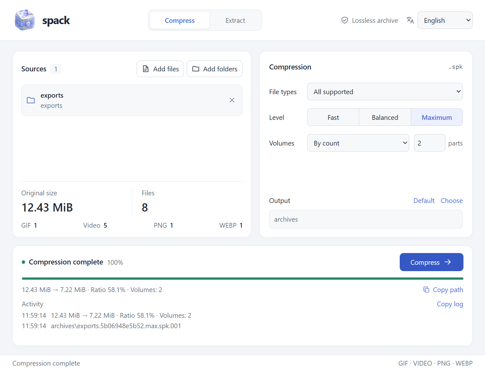

<div align="center">


<h1>
  
  spack
</h1>

<p><strong>Byte-exact archiving for batch media exports.</strong></p>

<p>
  <a href="https://github.com/Loping151/spack/releases/latest"></a>
  <a href="https://github.com/Loping151/spack/actions/workflows/build.yml"></a>
  
  
  <a href="LICENSE"></a>
</p>

<p><b>English</b> · <a href="README.zh-CN.md">简体中文</a></p>

</div>

spack is built for large collections exported from the same project: animation sets delivered as GIF and ProRes MOV, sticker and emote packs, CG image sets. Files in such a collection share characters, motion and layout. spack undoes the media encoding where it can, compresses what the files have in common, and restores every original file byte for byte.

## Highlights

- **Much smaller archives for animation exports.** On a 7.34 GB test collection, the spack archive is 2.5× smaller than zip.
- **Exact restoration.** Every file comes back byte for byte and is checked with BLAKE3; source files are never modified.
- **Desktop and command line.** One program for Windows, macOS and Linux, with an English and Simplified Chinese interface.
- **Ready for AI assistants.** JSON output on the command line and a built-in MCP server.

## Performance

Test set: 556 files from one animation export collection (278 GIF + 278 ProRes 4444 MOV), 7.34 GB. Measured on an 8-core desktop CPU (16 threads); sizes in decimal GB. Every archive was extracted and checked file by file.

| Tool | Archive | Of original | Compression time |
|---|---:|---:|---:|
| zip `-9` | 6.70 GB | 91.2% | 3 min |
| 7-Zip `-mx=9` | 6.08 GB | 82.9% | 3 min |
| zstd `-19 --long` | 6.00 GB | 81.7% | 6 min |
| **spack** `balanced` | **2.72 GB** | **37.1%** | 10 min |
| **spack** `max` | **2.66 GB** | **36.2%** | 12–15 min |

Extraction takes about 4 minutes. Results depend on the input: the largest gains come from ProRes 4444 animation exports and their GIF versions. Other formats (PNG, WebP, other video) use general-purpose compression and are still restored exactly.

## Download

Get the latest build from [Releases](https://github.com/Loping151/spack/releases/latest). The desktop builds also run as the command-line tool when started with arguments.

| Platform | Desktop | Command line only |
|---|---|---|
| Windows x64 | `spack-windows-x64.exe` (portable) | same file |
| macOS (Apple silicon and Intel) | `spack-macos-universal.dmg` or `.app.zip` | `spack-cli-macos-universal.tar.gz` |
| Linux x86_64 | `spack-linux-x86_64.AppImage` or `.deb` | `spack-cli-linux-x86_64.tar.gz` |

The Windows interface uses the system WebView2 Runtime. The macOS app is not notarized: on first launch, right-click it and choose Open, or run `xattr -dr com.apple.quarantine spack.app`. The Linux desktop build uses WebKitGTK; the command-line builds have no desktop dependencies.

## Usage



1. Add files or folders, then choose the file types and the level (`fast`, `balanced` or `max`).
2. Choose an output folder and, if needed, split the archive into volumes by count or size.
3. To extract, open a `.spk` archive or any of its numbered volumes; keep all volumes in one folder.

Extraction always creates a new folder and never overwrites. Relative paths are preserved; permissions, timestamps and empty folders are not archived. Older `.spack` archives remain readable.

## Command line

```sh
spack pack exports --preset max -o archives
spack pack images videos --parts 4 -o archives
spack pack media --filter no-video --part-size 100MiB -o archives
spack unpack archive.spk.001 -d restored
spack verify exports restored/exports
```

Filters: `all`, `gif`, `video`, `mov`, `no-gif`, `no-video`, `no-mov`. Presets: `fast`, `balanced`, `max`. `--parts` and `--part-size` are mutually exclusive. Run `spack --help` for all options; add `--lang zh-CN` (or set `SPACK_LANG=zh-CN`) for Simplified Chinese.

## For AI assistants

**Command line.** Add `--json` to any command. stdout then carries exactly one JSON object, `{"ok": true, "command": ..., "result": ...}` or `{"ok": false, "error": {"code": ..., "message": ...}}`, and progress goes to stderr as JSON lines. `--quiet` suppresses progress. Exit codes: `0` success, `1` error, `2` invalid usage, `130` cancelled.

```sh
spack --json scan /data/exports
spack --json --quiet pack /data/exports -o /data/archives --preset balanced
spack --json info /data/archives/exports.1a2b3c4d5e6f.balanced.spk
```

**MCP.** `spack mcp` runs a Model Context Protocol server over stdio with the tools `scan`, `pack`, `unpack`, `info` and `verify`, including progress notifications and cancellation.

```json
{
  "mcpServers": {
    "spack": { "command": "/path/to/spack", "args": ["mcp"] }
  }
}
```

With Claude Code: `claude mcp add spack -- /path/to/spack mcp`.

## Build

Requires Rust stable, Node.js 22+ and the platform's [Tauri prerequisites](https://v2.tauri.app/start/prerequisites/).

```sh
npm ci
npm run check
# Windows: portable spack.exe
npm run build
# macOS: universal .app and .dmg
npx tauri build --target universal-apple-darwin --bundles app,dmg
# Linux: AppImage and .deb
npx tauri build --bundles appimage,deb
```

On Windows, `./scripts/build-portable.ps1` runs the same steps and copies the result to `dist/spack.exe`. To build only the command-line tool:

```sh
cargo build --release --locked --manifest-path src-tauri/Cargo.toml --no-default-features
```

## License

[MIT](LICENSE). See [third-party notices](THIRD_PARTY_NOTICES.md) for dependencies.
