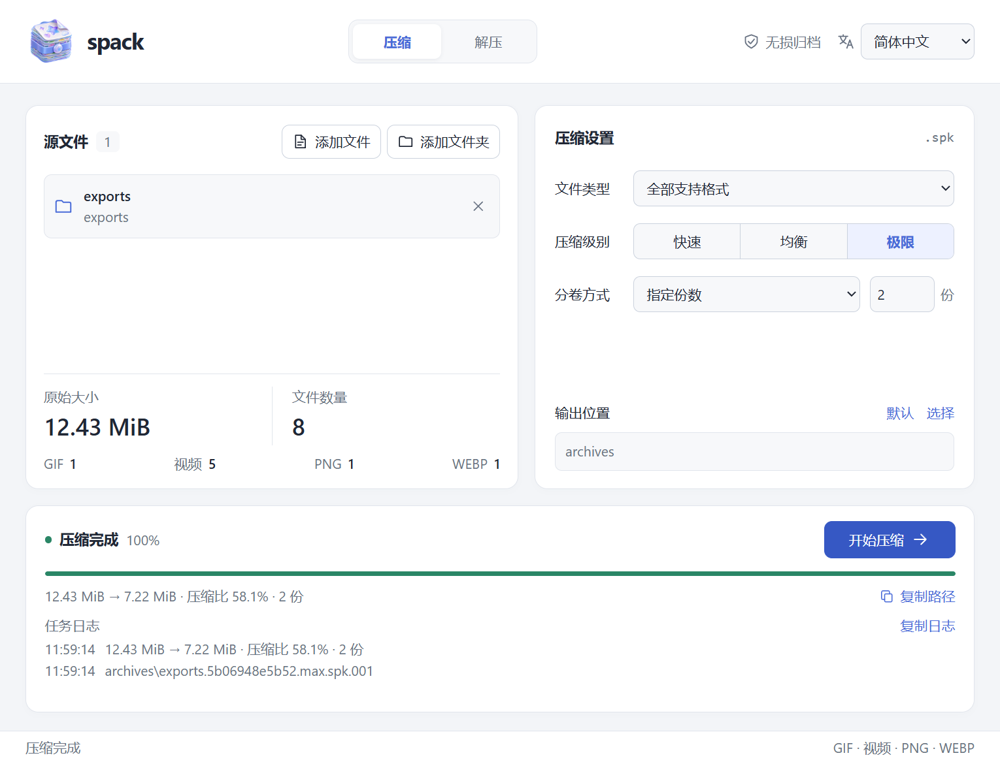

<div align="center">


<h1>
  
  spack
</h1>

<p><strong>面向批量导出媒体的字节无损压缩工具。</strong></p>

<p>
  <a href="https://github.com/Loping151/spack/releases/latest"></a>
  <a href="https://github.com/Loping151/spack/actions/workflows/build.yml"></a>
  
  
  <a href="LICENSE"></a>
</p>

<p><a href="README.md">English</a> · <b>简体中文</b></p>

</div>

spack 面向同一项目导出的大批素材，例如以 GIF 和 ProRes MOV 交付的动画合集、表情包、CG 图包。这类素材之间共享角色、动作和构图。spack 会尽可能还原媒体编码，压缩文件之间的共同部分，解压后逐字节恢复每一个原始文件。

## 亮点

- **动画导出素材压得更小。** 在一套 7.34 GB 的测试素材上，压缩后只有 zip 结果的 40% 左右。
- **精确还原。** 每个文件都逐字节恢复，并用 BLAKE3 校验；原始文件不会被修改。
- **桌面版和命令行。** 一个程序同时支持 Windows、macOS、Linux，界面提供中文和英文。
- **方便 AI 助手调用。** 命令行支持 JSON 输出，并内置 MCP 服务。

## 压缩效果

测试数据：同一动画导出合集中的 556 个文件（278 个 GIF 和 278 个 ProRes 4444 MOV），共 7.34 GB。测试机器为 8 核 16 线程的桌面 CPU，大小以十进制 GB 计。每个压缩包都做了解压和逐文件核对。

| 工具 | 压缩后 | 占原始 | 压缩用时 |
|---|---:|---:|---:|
| zip `-9` | 6.70 GB | 91.2% | 3 分钟 |
| 7-Zip `-mx=9` | 6.08 GB | 82.9% | 3 分钟 |
| zstd `-19 --long` | 6.00 GB | 81.7% | 6 分钟 |
| **spack** `balanced` | **2.72 GB** | **37.1%** | 10 分钟 |
| **spack** `max` | **2.66 GB** | **36.2%** | 12–15 分钟 |

解压约需 4 分钟。实际效果取决于素材，收益最大的是 ProRes 4444 动画导出文件及其对应的 GIF。其他格式（PNG、WebP、其他视频）使用通用压缩，同样逐字节还原。

## 下载

在 [Releases](https://github.com/Loping151/spack/releases/latest) 下载最新版本。桌面版带参数运行时也可以直接当命令行工具使用。

| 平台 | 桌面版 | 仅命令行 |
|---|---|---|
| Windows x64 | `spack-windows-x64.exe`（便携，无需安装） | 同一个文件 |
| macOS（Apple 芯片和 Intel） | `spack-macos-universal.dmg` 或 `.app.zip` | `spack-cli-macos-universal.tar.gz` |
| Linux x86_64 | `spack-linux-x86_64.AppImage` 或 `.deb` | `spack-cli-linux-x86_64.tar.gz` |

Windows 界面需要系统自带的 WebView2 Runtime。macOS 应用没有经过公证，首次打开时请右键选择"打开"，或执行 `xattr -dr com.apple.quarantine spack.app`。Linux 桌面版依赖 WebKitGTK，纯命令行版不需要任何桌面依赖。

## 使用



1. 添加文件或文件夹，选择文件范围和压缩级别（`fast`、`balanced` 或 `max`）。
2. 选择输出目录，需要的话按份数或大小分卷。
3. 解压时打开 `.spk` 或任意一个编号分卷，同一组分卷要放在同一目录下。

解压总是新建文件夹，不会覆盖已有文件。文件的相对路径会保留；权限、时间戳和空文件夹不会存入压缩包。原有的 `.spack` 压缩包仍然可以读取。

## 命令行

```sh
spack pack exports --preset max -o archives
spack pack images videos --parts 4 -o archives
spack pack media --filter no-video --part-size 100MiB -o archives
spack unpack archive.spk.001 -d restored
spack verify exports restored/exports
```

筛选：`all`、`gif`、`video`、`mov`、`no-gif`、`no-video`、`no-mov`。级别：`fast`、`balanced`、`max`。`--parts` 和 `--part-size` 不能同时使用。全部选项见 `spack --help`；加上 `--lang zh-CN`（或设置 `SPACK_LANG=zh-CN`）可以输出简体中文。

## 供 AI 助手使用

**命令行。** 任何命令加上 `--json` 后，标准输出只包含一个 JSON 对象：成功时是 `{"ok": true, "command": ..., "result": ...}`，失败时是 `{"ok": false, "error": {"code": ..., "message": ...}}`。进度以 JSON 行的形式写到标准错误，`--quiet` 可以关掉。退出码：`0` 成功，`1` 出错，`2` 用法无效，`130` 已取消。

```sh
spack --json scan /data/exports
spack --json --quiet pack /data/exports -o /data/archives --preset balanced
spack --json info /data/archives/exports.1a2b3c4d5e6f.balanced.spk
```

**MCP。** `spack mcp` 通过标准输入输出运行 Model Context Protocol 服务，提供 `scan`、`pack`、`unpack`、`info`、`verify` 五个工具，支持进度通知和取消。

```json
{
  "mcpServers": {
    "spack": { "command": "/path/to/spack", "args": ["mcp"] }
  }
}
```

在 Claude Code 中添加：`claude mcp add spack -- /path/to/spack mcp`。

## 构建

需要 Rust stable、Node.js 22 及以上版本，以及对应平台的 [Tauri 构建依赖](https://v2.tauri.app/start/prerequisites/)。

```sh
npm ci
npm run check
# Windows：便携版 spack.exe
npm run build
# macOS：通用 .app 和 .dmg
npx tauri build --target universal-apple-darwin --bundles app,dmg
# Linux：AppImage 和 .deb
npx tauri build --bundles appimage,deb
```

在 Windows 上也可以运行 `./scripts/build-portable.ps1`，它执行相同的步骤并把结果复制到 `dist/spack.exe`。只构建命令行程序：

```sh
cargo build --release --locked --manifest-path src-tauri/Cargo.toml --no-default-features
```

## 许可证

[MIT](LICENSE)。依赖说明见[第三方声明](THIRD_PARTY_NOTICES.md)。
